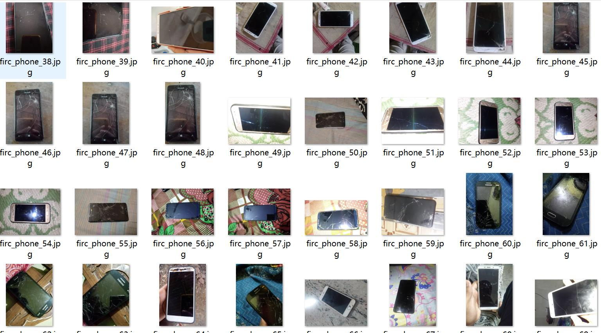
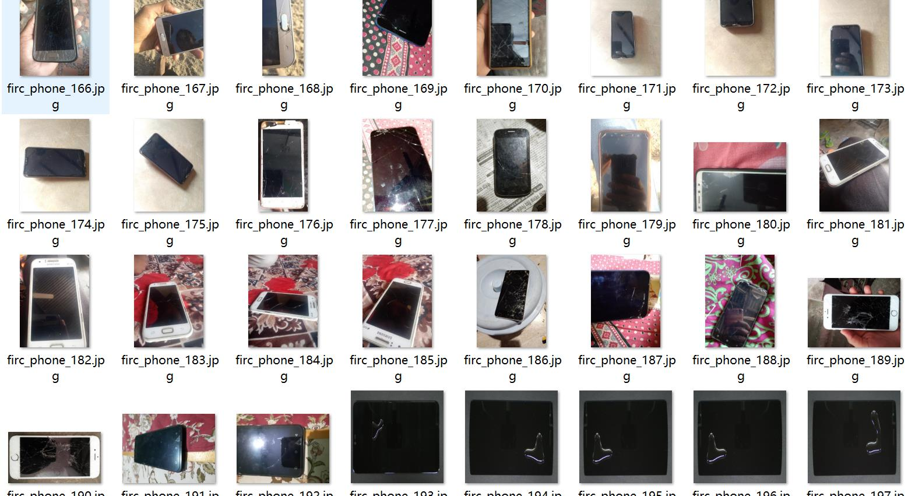
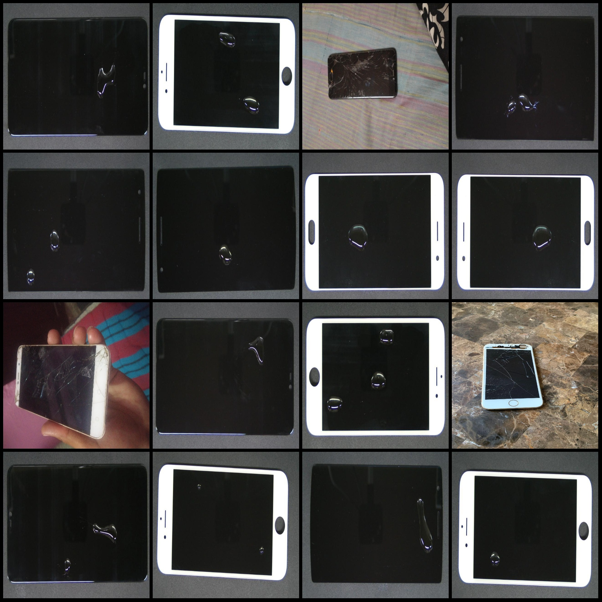
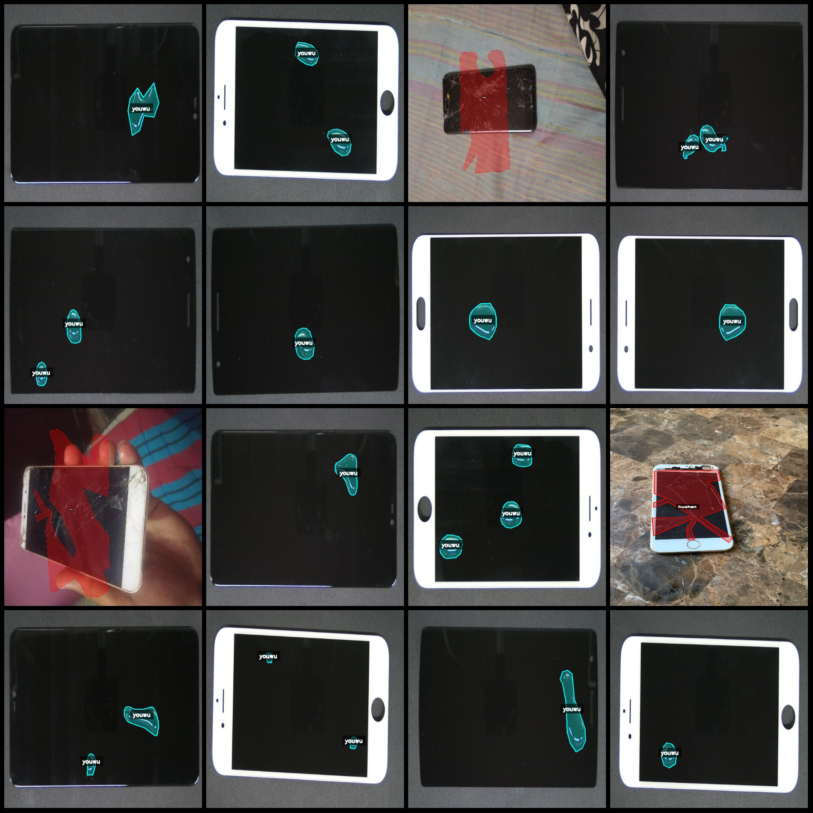
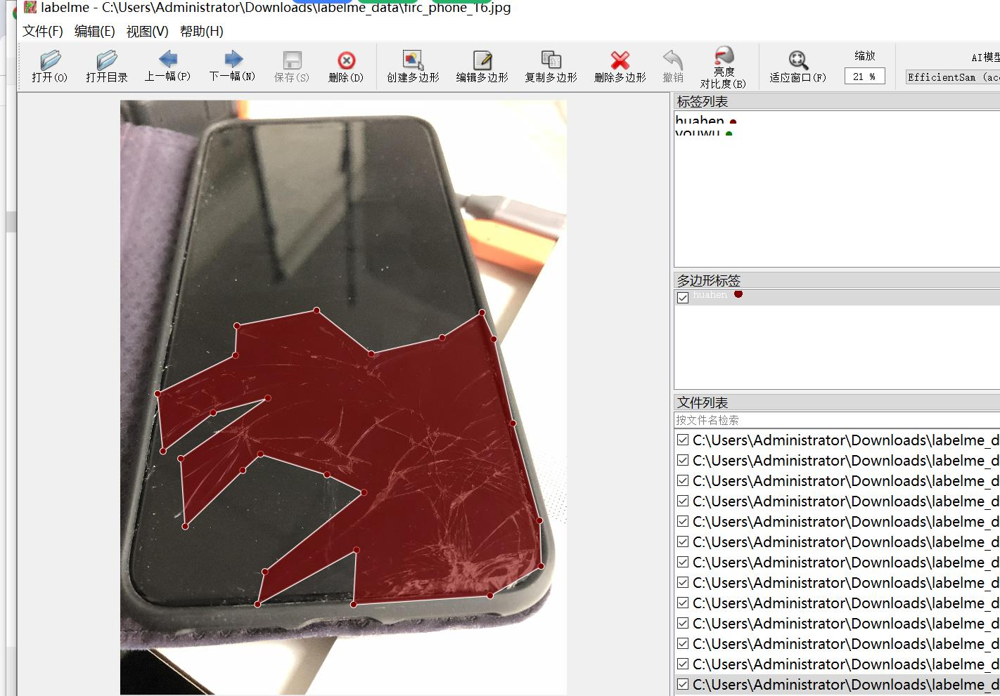

# Smartphone Screen Defects and Oil Stain Spots and Straight Lines Identification and Segmentation Dataset in labelme Format
1091 images (jpg files) with 2 categories

Dataset format: labelme format (excluding mask files, only containing jpg images and corresponding json files)
Number of images (number of jpg files): 1091
Number of annotations (json file count): 1091
Number of annotation categories: 2
Annotation category names: "huahen", "youwu"
Box count for each category:
- huahen (scratches) count = 377
- youwu (oil stains) count = 1235
Total boxes: 1612
Annotation tool used: labelme=5.5.0
Image resolution: 640x640
Annotation rules: draw polygons for categories
Important note: The dataset can be edited in labelme. The json dataset needs to be converted into either mask, yolo format, or coco format for semantic segmentation or instance segmentation.
Special declaration: This dataset does not guarantee the accuracy of the trained model or weight files.
Image preview:
Annotation example:
Randomly selected 16 images:
Annotation drawing results:
Labelme editing image example:

## Images

Here is a pay link on Stripe ( https://buy.stripe.com/3cs8yP7sY87d0vu9AB ). Please contact me lonlonago@foxmail.com after funding $89, and I will send you a complete data files , thank you!

